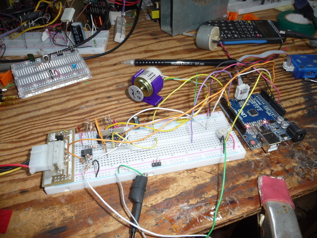
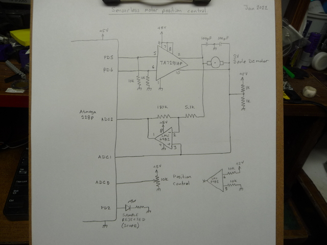

# sensorlessMotorPos
code to position motor based on backEMF and speed accumulation

This project was not my idea, I'm not the first to do it and my implementation isn't the best.

This uses the backEMF of a DC brushed motor to determine position via accumulated velocity.
The velocity measurement is done by reading the generated voltage from the armature of the motor between the PWM pulses.
Measurements suffer all sorts of evil things, the flyback from the drive pulse must first settle, and the measurement will be 
garbage if the commutators change as your trying to measure (big noise burst)

All in all, it worked WAY better than I thought it would!

Build photo and schematics:

